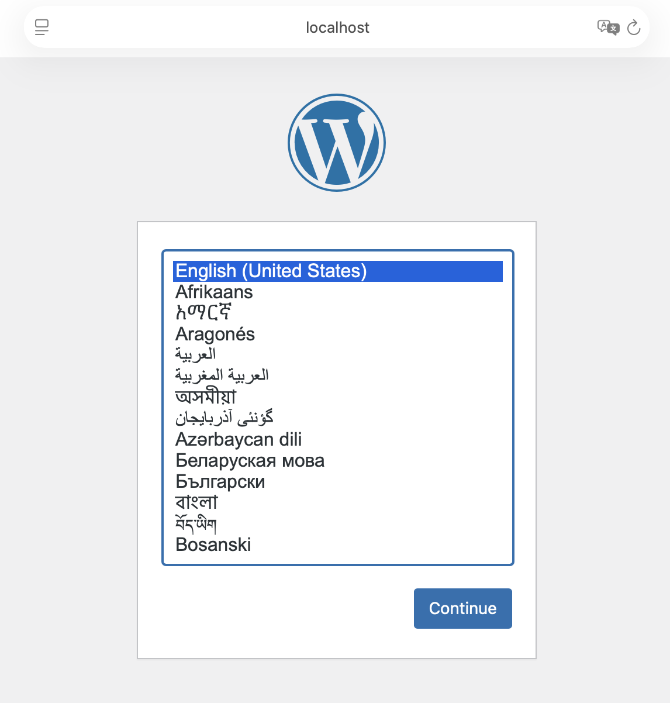
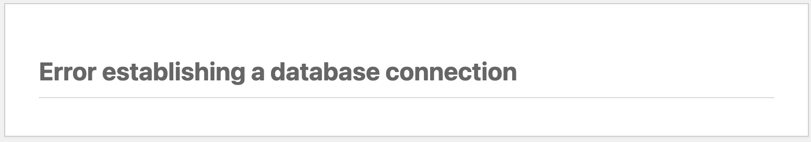
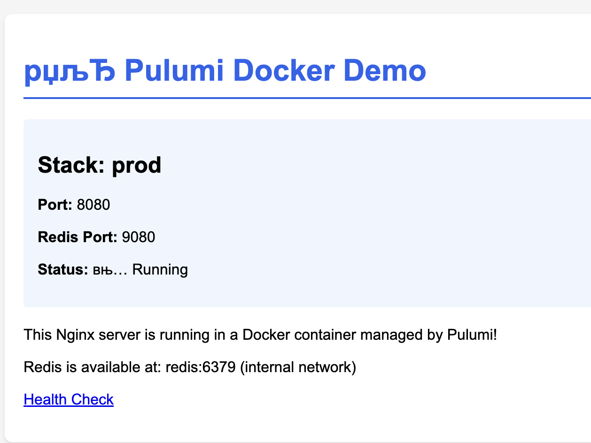

# Homework
## Lesson 1
### AWSCDK
#### Solution
**Deploy**
```
cdklocal deploy --all


✨  Synthesis time: 3.21s

StackOne: start: Building StackOne Template
StackOne: success: Built StackOne Template
StackTwo: start: Building StackTwo Template
StackTwo: success: Built StackTwo Template
StackOne: start: Publishing StackOne Template (current_account-us-west-2-6a4b3b93)
StackTwo: start: Publishing StackTwo Template (current_account-us-west-2-23a3a1f0)
StackOne: success: Published StackOne Template (current_account-us-west-2-6a4b3b93)
StackOne
StackTwo: success: Published StackTwo Template (current_account-us-west-2-23a3a1f0)
Stack StackOne
IAM Statement Changes
┌───┬─────────────────┬────────┬────────────────┬──────────────────────────┬───────────┐
│   │ Resource        │ Effect │ Action         │ Principal                │ Condition │
├───┼─────────────────┼────────┼────────────────┼──────────────────────────┼───────────┤
│ + │ ${MyBucket.Arn} │ Allow  │ s3:*           │ AWS:${MyRole}            │           │
├───┼─────────────────┼────────┼────────────────┼──────────────────────────┼───────────┤
│ + │ ${MyRole.Arn}   │ Allow  │ sts:AssumeRole │ Service:s3.amazonaws.com │           │
└───┴─────────────────┴────────┴────────────────┴──────────────────────────┴───────────┘
(NOTE: There may be security-related changes not in this list. See https://github.com/aws/aws-cdk/issues/1299)


"--require-approval" is enabled and stack includes security-sensitive updates: 'Do you wish to deploy these changes' (y/n) y
StackOne: deploying... [1/2]
StackOne: creating CloudFormation changeset...

 ✅  StackOne

✨  Deployment time: 5.11s

Stack ARN:
arn:aws:cloudformation:us-west-2:000000000000:stack/StackOne/9813fc3e-50a0-44d5-961d-eccceaf9efec

✨  Total time: 8.32s

StackTwo
Stack StackTwo
IAM Statement Changes
┌───┬─────────────────┬────────┬────────────────┬──────────────────────────┬───────────┐
│   │ Resource        │ Effect │ Action         │ Principal                │ Condition │
├───┼─────────────────┼────────┼────────────────┼──────────────────────────┼───────────┤
│ + │ ${MyBucket.Arn} │ Allow  │ s3:*           │ AWS:${MyRole}            │           │
├───┼─────────────────┼────────┼────────────────┼──────────────────────────┼───────────┤
│ + │ ${MyRole.Arn}   │ Allow  │ sts:AssumeRole │ Service:s3.amazonaws.com │           │
└───┴─────────────────┴────────┴────────────────┴──────────────────────────┴───────────┘

 ✅  StackTwo

✨  Deployment time: 5.15s

Stack ARN:
arn:aws:cloudformation:us-west-2:000000000000:stack/StackTwo/d570b5a7-3f7c-40b4-94df-f59ed4f36f5d

✨  Total time: 8.36s
```
---
**After instal check**

[IAM Roles](./homework/lesson1/awscdk/iam_check.json)

```
cat iam_check.json | jq '.Roles[].RoleName'
"cdk-hnb659fds-lookup-role-000000000000-us-west-2"
"StackOne-MyRoleF48FFE04-b387c0b3"
"cdk-hnb659fds-file-publishing-role-000000000000-us-west-2"
"cdk-hnb659fds-image-publishing-role-000000000000-us-west-2"
"cdk-hnb659fds-deploy-role-000000000000-us-west-2"
"cdk-hnb659fds-cfn-exec-role-000000000000-us-west-2"
"StackTwo-MyRoleF48FFE04-775b9a31"
```

S3 buckets:
```
aws --endpoint-url=$AWS_ENDPOINT_URL s3 ls
2025-11-20 17:34:32 cdk-hnb659fds-assets-000000000000-us-west-2
2025-11-20 17:35:22 my-unique-bucket-stackone
2025-11-20 17:35:30 my-unique-bucket-stacktwo
```
#### Challenges

Only challenge I faced, was bootstrap error. Reason - was missed one env variable `AWS_ENDPOINT_URL_S3=http://s3.localhost.localstack.cloud:4566`.

Solution was found on stackoverflow here -->> [StackOverflow.com](https://stackoverflow.com/a/78943476/11205458)

---
### CDKTF
#### Solution

**After Deploy Check**
```
cdktf-docker-wordpress % docker ps
CONTAINER ID   IMAGE              COMMAND                  CREATED          STATUS          PORTS                               NAMES
5510b5daef18   wordpress:latest   "docker-entrypoint.s…"   19 seconds ago   Up 18 seconds   0.0.0.0:8082->80/tcp                wordpress-StackTwo
b7513cbc6e40   mysql:9.5.0        "docker-entrypoint.s…"   19 seconds ago   Up 18 seconds   33060/tcp, 0.0.0.0:9082->3306/tcp   mysql-StackTwo
8d947cc3bd71   wordpress:latest   "docker-entrypoint.s…"   2 minutes ago    Up 2 minutes    0.0.0.0:8081->80/tcp                wordpress-StackOne
0732f923cb7b   mysql:9.5.0        "docker-entrypoint.s…"   2 minutes ago    Up 2 minutes    33060/tcp, 0.0.0.0:9081->3306/tcp   mysql-StackOne
```
**Here is [main.ts](./homework/lesson1/cdktf/cdktf-docker-wordpress/main.ts) file and working page screenshot**




---
#### Challenges

1. Import looks a little different after version 0.13, because each module imports from separate workspace according to [CDKTF changelog](https://classic.yarnpkg.com/en/package/cdktf-cli#:~:text=0.13.0,service%20import%20Service)
2. I've changed MySQL image version to **8.0** because of error `Error: Unable to read Docker image into resource: unable to find or pull image mysql:5.7`
3. First synth crashed because of `image: wordpressImage.latest,` so I've changed it to `image: wordpressImage.name`. Although after deploy I faced with an db connectivity error:

It was hostname variable mismatch. Fixed with `WORDPRESS_DB_HOST=mysql-${id}:3306`

---


### Pulumi
#### Solution

```pulumi stack ls       
NAME   LAST UPDATE     RESOURCE COUNT
dev    59 seconds ago  8
prod*  5 seconds ago   8
```
Env outputs:
```
Current stack outputs (3):
    OUTPUT     VALUE
    nginxUrl   http://localhost:8080
    redisPort  7080
    stackInfo  {"name":"prod","nginxContainer":"nginx-prod","redisContainer":"redis-prod"}

Current stack outputs (3):
    OUTPUT     VALUE
    nginxUrl   http://localhost:8081
    redisPort  7081
    stackInfo  {"name":"dev","nginxContainer":"nginx-dev","redisContainer":"redis-dev"}
```
Docker containers:
```
CONTAINER ID   IMAGE          COMMAND                  CREATED         STATUS         PORTS                    NAMES
dbf49cd57fac   50ffaab4a072   "docker-entrypoint.s…"   3 minutes ago   Up 3 minutes   0.0.0.0:9080->6379/tcp   redis-prod
44ffa1741e6b   cbad6347cca2   "/docker-entrypoint.…"   3 minutes ago   Up 3 minutes   0.0.0.0:8080->80/tcp     nginx-prod
7a9902767f0d   50ffaab4a072   "docker-entrypoint.s…"   4 minutes ago   Up 4 minutes   0.0.0.0:9081->6379/tcp   redis-dev
a777651f49ff   cbad6347cca2   "/docker-entrypoint.…"   4 minutes ago   Up 4 minutes   0.0.0.0:8081->80/tcp     nginx-dev
```
Health check:
```
curl http://localhost:8080/health
healthy
curl http://localhost:8081/health
healthy
```
Redis check:
```
docker exec -it redis-prod redis-cli ping
PONG
docker exec -it redis-dev redis-cli ping
PONG
```
Web check:


#### Challenges
No challenges faced during deployment

---

## CUE Lang Homework

Solution can be found here --> [**README.md**](./homework/cue/README.md)

## Timoni Homework

Solution can be found here --> [**README.md**](./homework/timoni/README.md)