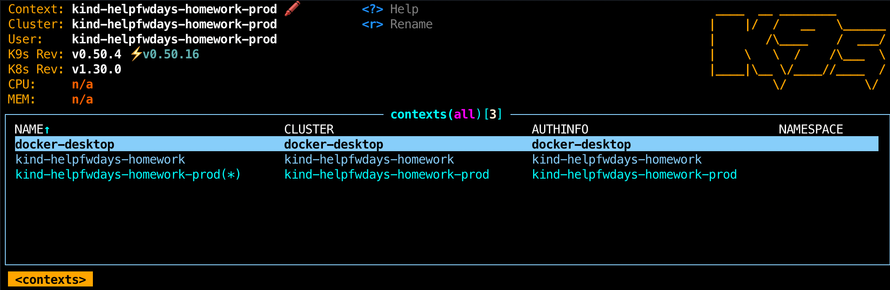
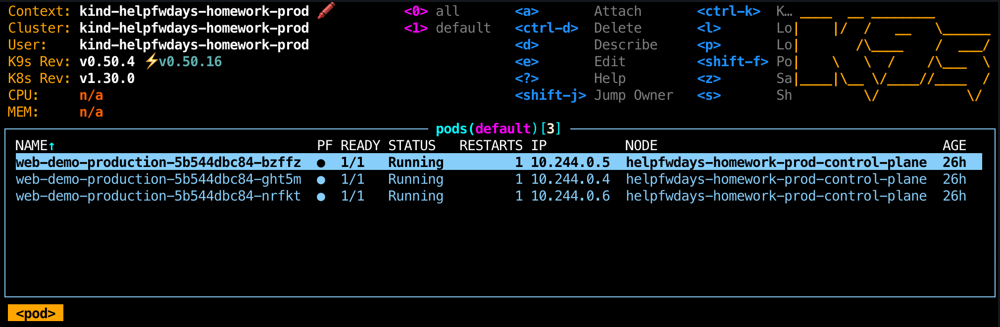
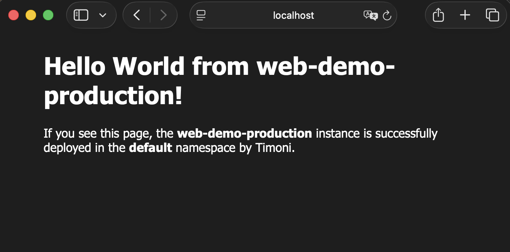

# Timoni Homework
## Structure
```
.
├── bundle.cue
├── img
│   ├── contexts.png
│   ├── pods-prod.png
│   └── webpage-deployed-prod.png
├── my-web-app
│   ├── cue.mod
│   │   ├── gen
│   │   ├── module.cue
│   │   └── pkg
│   ├── debug_tool.cue
│   ├── debug_values.cue
│   ├── README.md
│   ├── schema.cue
│   ├── templates
│   │   ├── config.cue
│   │   ├── configmap.cue
│   │   ├── deployment.cue
│   │   ├── ingress.cue
│   │   ├── job.cue
│   │   ├── service.cue
│   │   └── serviceaccount.cue
│   ├── timoni.cue
│   ├── timoni.ignore
│   └── values.cue
├── README.md
├── runtime.cue
└── schema.cue

7 directories, 22 files
```

## Solution
### Resources:
All cue templates can be found in [**templates**](./my-web-app/templates/) folder

There is also a config file — basically the place where we tell timoni which resources we want to deploy for a given instance.


There is also a [**config**](./my-web-app/templates/config.cue) - basically the place where we tell timoni which resources we want to deploy for a given **#Instance**.

Default values stores in [**values.cue**](./my-web-app/values.cue) when deploying a **single resource** and can be overridden through [**bundle.cue**](./bundle.cue) when it's **bundle** type deployment.

And [**runtime.cue**](./runtime.cue) file inspects the cluster fleet before deployment and exposes cluster IDs and metadata to the bundle. This lets us customize configuration depending on the target cluster. 

*Example:*
```
timoni runtime build -f ./my-web-app/runtime.cue 
4:16PM INF r:fleet > c:kind-helpfwdays-homework > CLUSTER_UID: 911f0e9b-b351-4a15-a778-98c313a7212f
4:16PM INF r:fleet > c:kind-helpfwdays-homework-prod > CLUSTER_UID: b8976c75-a5a1-4d59-89df-e79d1e65a5a0
```

### Deployment process and statuses:
We have fleet of two Kubernetes clusters(stage and prod):


Below is an example of a dry-run using `timoni bundle apply --dry-run --diff`.
This shows the diff and planned changes. Removing `--dry-run` applies changes in real clusters.
```
timoni bundle apply --dry-run --diff -f bundle.cue -r runtime.cue
6:46PM INF b:apps > c:kind-helpfwdays-homework > applying 1 instance(s) on staging (server dry run)
6:46PM INF b:apps > c:kind-helpfwdays-homework > i:web-demo-staging > applying module timoni.sh/my-web-app version 0.0.0-devel
6:46PM INF b:apps > c:kind-helpfwdays-homework > i:web-demo-staging > ServiceAccount/default/web-demo-staging unchanged (server dry run)
6:46PM INF b:apps > c:kind-helpfwdays-homework > i:web-demo-staging > ConfigMap/default/web-demo-staging-d63d6809 unchanged (server dry run)
6:46PM INF b:apps > c:kind-helpfwdays-homework > i:web-demo-staging > Service/default/web-demo-staging unchanged (server dry run)
6:46PM INF b:apps > c:kind-helpfwdays-homework > i:web-demo-staging > Deployment/default/web-demo-staging configured (server dry run)

metadata.generation
± value change
- 1
+ 2

spec.template.spec.containers.web-demo-staging
- two map entries removed:   + one map entry added:
livenessProbe:                 env:
│ failureThreshold: 3          - name: ENV
│ httpGet:                     │ value: staging
│ │ path: /healthz
│ │ port: http
│ │ scheme: HTTP
│ periodSeconds: 10
│ successThreshold: 1
│ timeoutSeconds: 1
readinessProbe:
│ failureThreshold: 3
│ httpGet:
│ │ path: /healthz
│ │ port: http
│ │ scheme: HTTP
│ periodSeconds: 10
│ successThreshold: 1
│ timeoutSeconds: 1

6:46PM INF b:apps > c:kind-helpfwdays-homework > i:web-demo-staging > applied successfully (server dry run)
6:46PM INF b:apps > c:kind-helpfwdays-homework > applied successfully (server dry run)
6:46PM INF b:apps > c:kind-helpfwdays-homework-prod > applying 1 instance(s) on production (server dry run)
6:46PM INF b:apps > c:kind-helpfwdays-homework-prod > i:web-demo-production > applying module timoni.sh/my-web-app version 0.0.0-devel
6:46PM INF b:apps > c:kind-helpfwdays-homework-prod > i:web-demo-production > ServiceAccount/default/web-demo-production unchanged (server dry run)
6:46PM INF b:apps > c:kind-helpfwdays-homework-prod > i:web-demo-production > ConfigMap/default/web-demo-production-b285b994 unchanged (server dry run)
6:46PM INF b:apps > c:kind-helpfwdays-homework-prod > i:web-demo-production > Service/default/web-demo-production unchanged (server dry run)
6:46PM INF b:apps > c:kind-helpfwdays-homework-prod > i:web-demo-production > Deployment/default/web-demo-production configured (server dry run)

metadata.generation
± value change
- 1
+ 2

spec.template.spec.containers.web-demo-production
+ one map entry added:
  env:
  - name: ENV
  │ value: production

6:46PM INF b:apps > c:kind-helpfwdays-homework-prod > i:web-demo-production > applied successfully (server dry run)
6:46PM INF b:apps > c:kind-helpfwdays-homework-prod > applied successfully (server dry run)
```
After dry-run, we apply it and check deployed instances.

Staging:
```
kubectl config use-context kind-helpfwdays-homework
Switched to context "kind-helpfwdays-homework".
timoni list                                  
NAME               MODULE          VERSION         LAST APPLIED            BUNDLE 
web-demo-staging        my-web-app      0.0.0-devel     2025-11-28T15:15:36Z    apps    
```
Production:
```
kubectl config use-context kind-helpfwdays-homework-prod 
Switched to context "kind-helpfwdays-homework-prod".
timoni list                                       
NAME                       MODULE          VERSION         LAST APPLIED            BUNDLE 
web-demo-production     my-web-app      0.0.0-devel     2025-11-28T15:15:46Z    apps    
```
As we can see, all pods are up and running

Web page check after port forward - successful:


### Report

**My-web-app** module is a small, configurable NGINX-based web application packaged with timoni. 

Includes:
  - Deployment with customizable env vars, resources and health checks
  - Service
  - ServiceAccount
  - ConfigMap
  - Optional Ingress to expose app outside the cluster.

The module separates configuration, templates and values into different files making setup easy to reuse and adapt.

Because deployment is powered by timoni bundles + runtime, we can safely deploy same module across multiple clusters with different parameters. Bundle logic is defined in [**bundle.cue**](./bundle.cue), while runtime information (such as cluster IDs) is injected from [**runtime.cue**](./runtime.cue).

